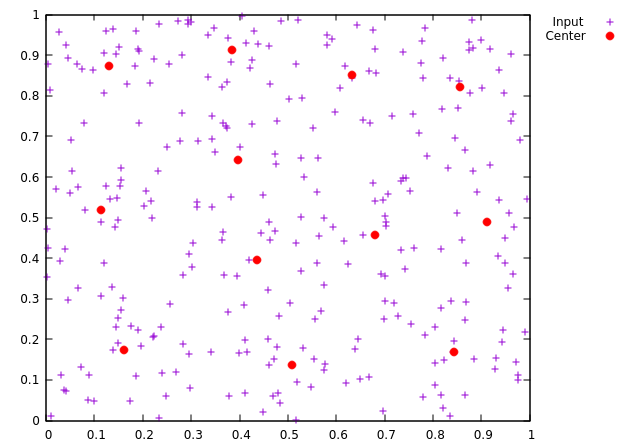
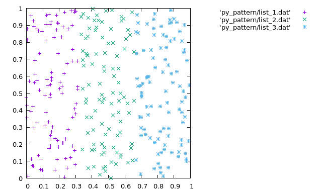

## Multi-Neural-Gas
### Requirement

* JDK(Java Development Kit) 1.8


### How to Run

To run this program in terminal first compile it with javac:

```
$ javac MNG.java
```

then run it with one argument:

```
$ java MNG File1
```

for example:

```
$ java MNG Train/PA-D.dat
```

### Input File Format

The training data file contains the input patterns(one pattern per line).

For example:

0.261029	0.699058

0.222308	0.408081

0.446747	0.281877

.
.


You have to enter the total number of pattern in console(the number of lines in the input file e.g 300 for PA-D.dat).


### Training Data

The file **PA-D.dat** contains the patterns drawn randomly, equally distributed from 3 non-overlapping areas.

For N=2, they have been drawn from a unit square with the boundaries [0,1/3) , [1/3,2/3), [2/3,1) .

The data was produced by using a python code(genRandom.py). The total number of 300 pattern has been constructed (100 from each boundary).

The number of random sample for each boundaries can be changed in the python code. For example in the following code it is 100.

``` python
f_1 = 1/3.0
list_1 = [[random.uniform(0,f_1-0.01),random.uniform(0,1)] for i in range(0,100)]

```

All other parameters including M, N, K, eta_init, eta_end, size, t_max can be changed in the **init()** function in the MNG class in **MNG.java** file.


```java
        //total number of neurons
        K = 12;

        //input dimension
        N = 2;

        //number of partner net
        M = 4;

        //number of learning steps
        t_max = 500;

        //final learning rate
        eta_end = 0.02;

        //initial learning rate
        eta_init = 0.5;

    	//size of the neighborhood function, s
	size = 0.4;

```

The **PA-D.net** is the output file with each the learnt centers in each line. This file is located(or will be created) at the same directory
as the code resides.


Here is two graphs from the result. One shows the distribution of data and the other one the position of centers.

| Position of centers:
| -----------------------
| 


|Distribution of data from the each boundary:
|------------------------------------------
|


Author:Emad Bahrami Rad

Email: emadbahramirad@gmail.com
